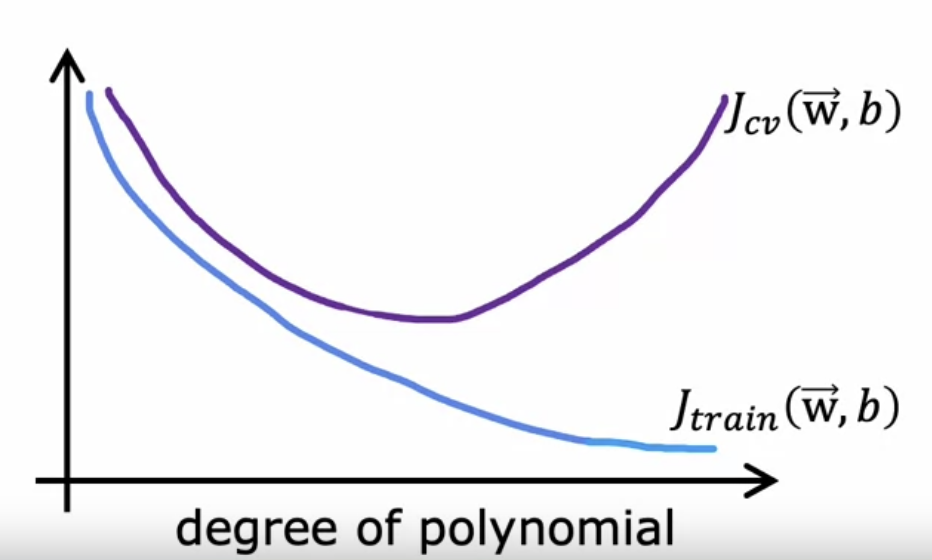
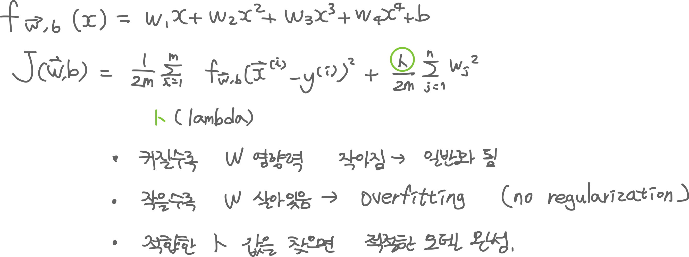

## 20221122 - 코세라 강의

- Advanced Learning Algorithms 3주차 (2)
    - bias & variance 

---

### Diagnosing bias and variance
- High bias : underfit (차원이 낮을 때)
    - Jtrain is high : 훈련 세트에 대한 오차가 큼
    - Jcv is high : 검증 세트에 대한 오차가 큼
- High variance : overfit (차원이 높을 때)
    - Jtrain is low : 훈련 세트에 대한 오차가 작음
    - Jcv is high : 검증 세트에 대한 오차가 큼
- 예측이 잘 된 경우
    - Jtrina is low, Jcv is low : 훈련과 검증 세트에 대한 오차가 작음.
- training error - feature 차원에 대한 그래프를 그리면 순차적으로 감소하는 그래프가 그려짐
- cross validataion error - feature 차원에 대한 그래프를 그리면 초기에는 감소하다가 높아지는 경우가 생김. 

### Regularization and bias/variance
- lambda : 훈련 데이터와 얼마나 적합하게 업데이트 할 것인지 속도 조절

- lambda 값을 키워가면서 cv error가 가장 작은 경우를 선택 -> test 데이터를 통해 검증

### Establishing a baseline level of performance
1. baseline performance(기준점) <-> Training error 의 차이
2. Training error <-> Cross validation error 의 차이
* 1, 2를 비교했을 때 1이 크면 bias (편향)가 높은 것, 2가 크면 variance (변량)가 높은 것
* 1, 2 모두 큰 경우에는 high bias, high variance
  
* 기준점 예시 : domain에 따라 다르다
    * Human level performance
    * competing algorithms performance
    * Guess based on experience

---

### 용어
* 음성인식 
    * Automatic Speech Recognition
    * Speech to Text <-> Text to Speech