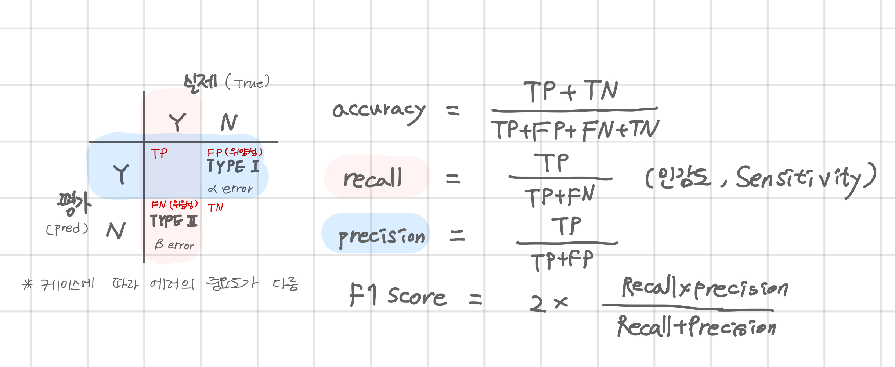

## 20221123 - 코세라 강의

- Advanced Learning Algorithms 3주차 (2) 이어서

---

### Learning Curves
* training set의 크기가 커지면
    * cv의 에러는 감소하는 추세를 보이고 (점점 완만)
    * 훈련데이터의 에러는 증가하는 추세를 보임 (점점 완만)

* baseline과 비교했을 때
    * high bias : 훈련/검증 데이터의 에러가 더 클 때 모델 개선 여지가 있음
    * high variance : 훈련 데이터의 에러는 기준보다 작은데, 검증 데이터의 에러는 기준보다 클 때 데이터의 수를 늘리는 방법 등이 있음

* bias가 높을 때
    * 데이터를 늘리기 보다 모델을 늘리기
    * 람다를 줄이기 
* variance가 높을 때
    * 데이터를 추가하고 람다를 늘리기 

* Neural networks 
    * 클수록 더 복잡한 모델 = bias가 줄어듦. (훈련 데이터에 최적화 시킴)
    * 클수록 비용과 시간 증가
    * 큰 모델을 쓰고 regularization을 사용하는 것이 좋다.
        * `kernel_regularization()`

---

### 용어
* kernel == weight

* Type 1, Type 2 error 
