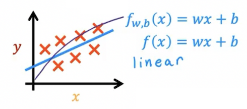
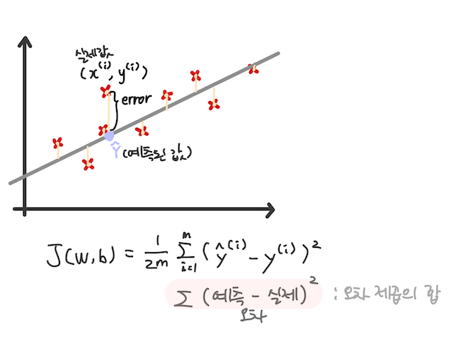
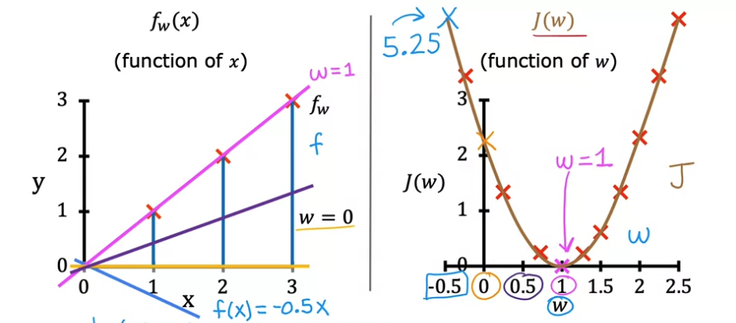

# 20220914

- AI 강좌 필기 정리

! latex : 기호 작성할 때 유용함. 찾아보기~

---

## Linear regression model
> 지도학습의 선형 회귀 학습

- 선형 회귀 : `f(x) = wx + b`
    - input `x`, `feature`
    - output `y`, `target`
    - m : number of training examples
    - (x, y) = single training example
    - (x^(i), y^(i)) = i번째 training example
        - 제곱 아님

- 지도학습의 작동 알고리즘
    1. feature와 target 값이 있는 training set
    2. learning algorithm 
        - ex) gredient decient
    3. 함수식에 넣으면 예측 값 (y-hat) 도출할 수 있도록 가설(hypothesis)함수 작성
        - x(feature) -> f(model) -> y^(prediction, estimated y)
        - 최적의 가설함수를 찾는 방법 = 비용함수 이용
- ! 2차식, 3차식도 linear하다는데,,, 

- Univariate linear regression 
    - Linear regression with one variable
    - 단변량 선형 회귀식 (x가 하나라는 뜻)

#

## Cost function 
> Squared error : 오차 제곱합 이용
  

- 비용 함수 : 원래 값과 가장 오차가 작은 가설함수를 도출하는 매개변수를 찾기 위해 사용
    
    - parameters (=coefficients 계수, weights 가중치) : 알아내야 할 값
    - 미분 계산을 위한 `1/2` 상수 곱이 포함됨

- 비용 함수 그래프
    
    - 제곱 오차를 가능한 작게 만드는 w를 선택
    - 해당 그래프에서는 w=1일 때 가장 작은 오차 (오차 없음)
    .png)
    - 3차원으로 볼 때 가장 오목한 부분이 minimum
    .png)
    - w, b, j(w,b) 이렇게 3차원의 그래프에서는 하나의 점으로 표기되는 우측 그래프
    - j(w, b) 좌측의 직선 그래프로 나타남

### 내일 배울 내용
* GD (경사 하강법) : 손실함수의 최소로 가는 weight를 찾는 방법론
    * SGD (확률적 경사 하강법)

