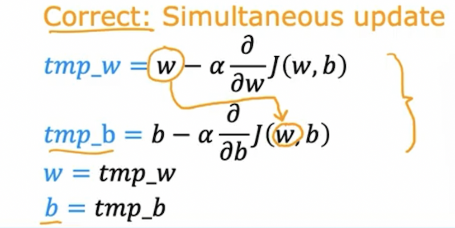
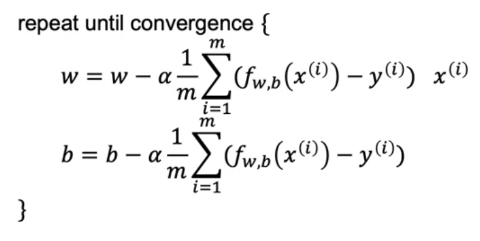

# 20220915~16

- AI 강좌 필기 정리

---

## Gredient descent
> 경사 하강. 비용함수 최소 weight를 찾는 방법.
- 딥러닝에서도 사용
- local minimum : 그 구간에서의 최소
- global minimum : 전체에서 최소
- 주위를 돌다 가장 가파른 내리막 방향으로 가는 것을 비유
    - 어느 방향을 선택하느냐에 따라 전혀 다른 local minimum이 나올 수 있음.
    - 한 minimum이 선택되면 다른 minimum은 전혀 찾지 못하게 됨.

### 경사 하강 구현

> w와 b를 업데이트 -> 업데이트 결과를 반영
>> w 업데이트 후 적용해서 b 구하면 안됨 (전혀 다른 결과)
- 순서
.png)
- 손실함수를 미분 : Derivative (델타)
- 기존 w - 학습률*(미분한 손실함수)
    - 기존 w 값이 minimum일 때 보다 클 경우 우측에 위치하게 됨 -> 기울기 Positive
    - 반대로 minimum일 때 보다 작을 경우 좌측에 위치하게 됨 -> 기울기 Negative

## Learning rate
> 학습률

.png)
- 작을수록 천천히 경사 하강. : 느려...
- 매우 큰 경우 빠르게 경사 하강. : Overshoot (never reach minimum)
- 미분한 손실 함수가 0(zero)이 되었을 때 local minimum 결정
    - w가 더이상 업데이트 되지 않게됨.

  
.png)
- 미분한 손실 함수의 기울기가 가파를 때 빠르게 감소함
- local minimum에 가까워 질수록 변화량은 작아짐.

- 선형 회귀(1차식)는 손실 함수가 최소가 되는 경우가 한 가지 밖에 없음
    - single local minimum = global minimum (무조건 찾을 수 있음)
    - bowl shape : convex function (볼록 함수) -> 아래로 볼록한 형태
        - concave function : 위로 볼록한 형태

- Batch 전체 데이터
    - Each step of gradient descent uses all the training examples. (모든 단계 훈련 example을 사용함)
    - mini batch : 전체 batch를 쪼개서 일부만 사용할 때

