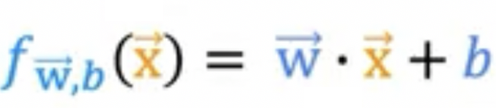
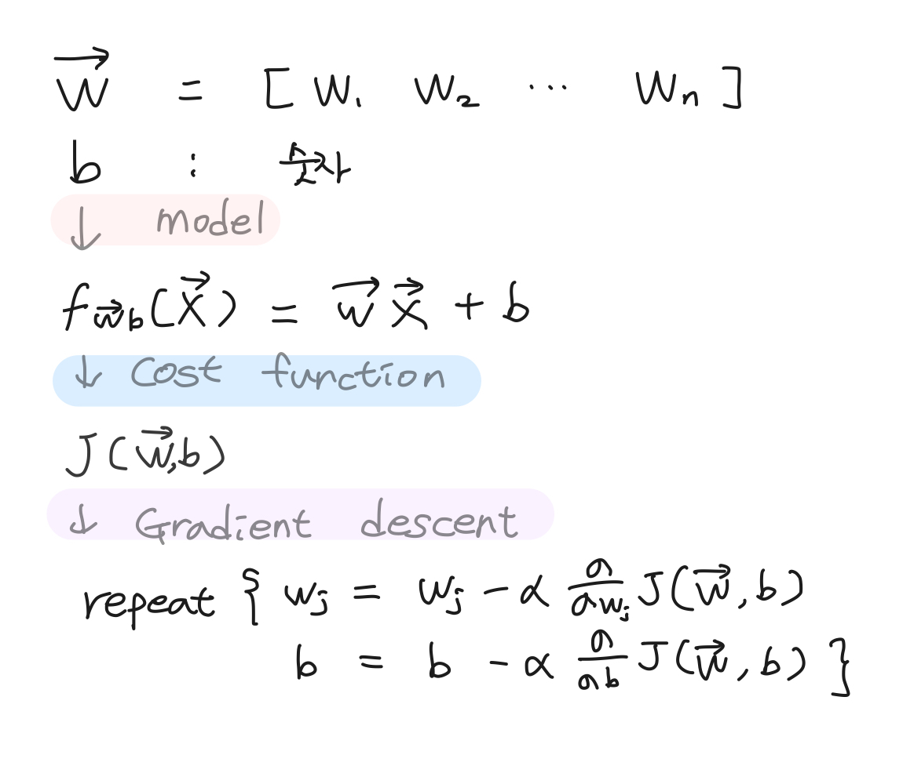

# 20220920

- AI 강좌 필기 정리
    - Jupyter notebook 풀어볼것!

---

## review
- f(x) = wx + b
    - 파라미터는 학습이 되어야 하는 대상
    - x 값은 고정되어 있음
    - f(x) = np.dot(w, x)
- loss function
    - error가 가장 적어지는 방법을 선택
    - 예측값과 실제값의 차를 제곱할 수도 있고, 절대값을 구할 수도 있음
        - 거리를 측정할 때 목적에 따라서 측정 방법이 다르기 때문에
- Gradient Descent

## Multiple features
> multiple linear regression : 다중 선형 회귀
(not mulitvariate regression - 다변량 선형 회귀)

- X의 변수(독립변수)가 여러개
    - 여러개의 특성을 이용해 종속변수(y) 예측
- 다중 선형회귀 가정
    - 각각의 독립변수는 종속변수와 선형 관계 존재
    - 독립변수 사이에서는 상관관계가 높지 않아야 함
    - 추정된 종속 변수값과 실제 종속변수 값의 잔차가 정규분포를 이뤄야 함

- 이미지에서 -> 는 1, 2, 3...n 순서대로 벡터화 되어있음을 의미

#

## Vectorization
> 컴퓨터가 계산을 빠르게 하도록 하는 방법
> 벡터화 `[1 2 3 4 5]`
- 인덱스가 동일한 것 끼리 벡터간 연산이 가능
    - for loop 보다 속도 빠름
    - `np.dot(w, x)+b` : w1x1 + w2x2 + ... wnxn + b
        - 내적 : 안에 쌓는것. 벡터 각각의 요소를 하나씩 곱하고 그 곱들을 더한 것 
            - 벡터간의 거리 계산시에 유효하게 사용됨
            - 4 by 4 metrix 계산시 : (1 * 4)(4 * 1) = (1차원)
        - 외적 : 차원이 늘어남
            - 4 by 4 metrix 계산시 : (4 * 1)(1 * 4) = (4차원)

#

## Gradient descent for multiple linear regression
> Vectorization을 통해 weight가 많을 경우 array화 해서 빠르게 계산할 수 있음

- 최적화 방법 Optimization
    - Gradient Descent 
    - Normal equation : 한방에 계산할 수 있음. 일반화 잘 안됨. 
