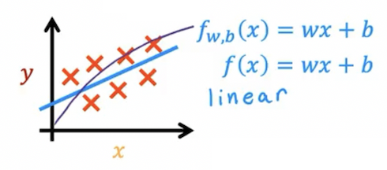
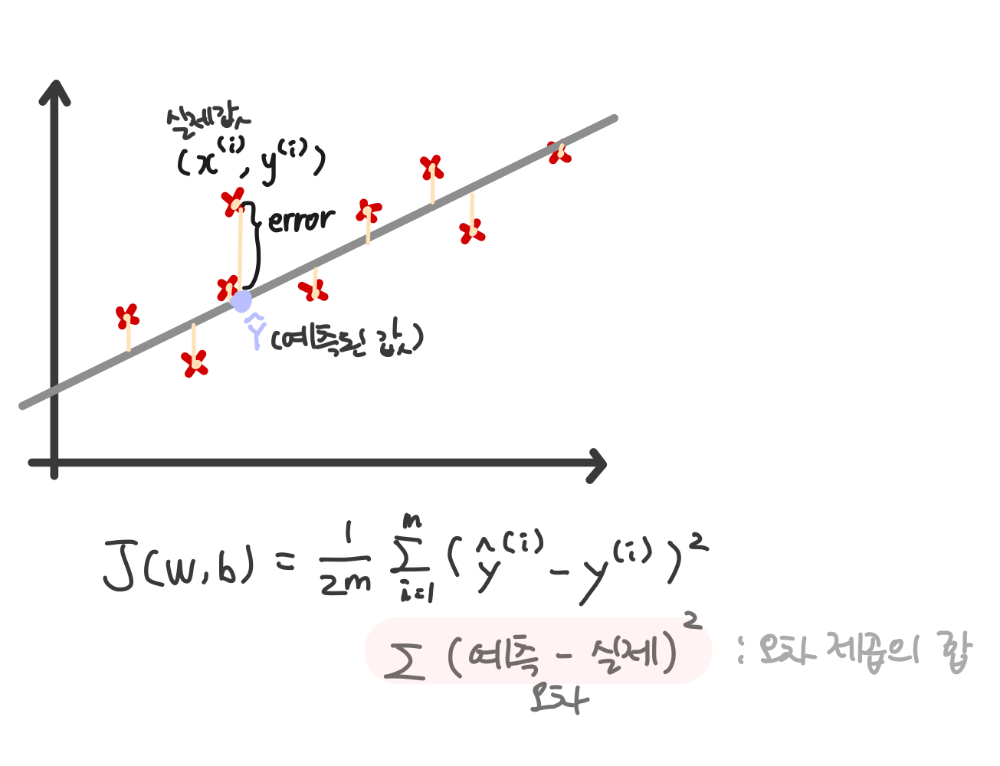

# 20220914

- AI 강좌 필기 정리
    
---

## Linear regression model

- 선형 회귀 : `f(x) = wx + b`
    - input (x, feature) 
    - output (y, target)
    - m : number of training examples
    - (x, y) = single training example
    - (x^(i), y^(i)) = i번째 training example
        - 제곱 아님

- 지도학습의 작동 알고리즘
    1. feature와 target 값이 있는 training set
    2. learning algorithm 
    3. 함수식에 넣으면 예측 값 (y-hat) 도출할 수 있도록 가설함수 작성
        - x(feature) -> f(model) -> y^(prediction)
        - 최적의 가설함수를 찾는 방법 = 비용함수 이용

- Univariate linear regression 
    - Linear regression with one variable
    - 단변량 선형 회귀식 (x가 하나라는 뜻)

## Cost function 
> Squared error : 오차 제곱합 이용

- 비용함수 : 원래 값과 가장 오차가 작은 가설함수를 도출하는 매개변수를 찾기 위해 사용

