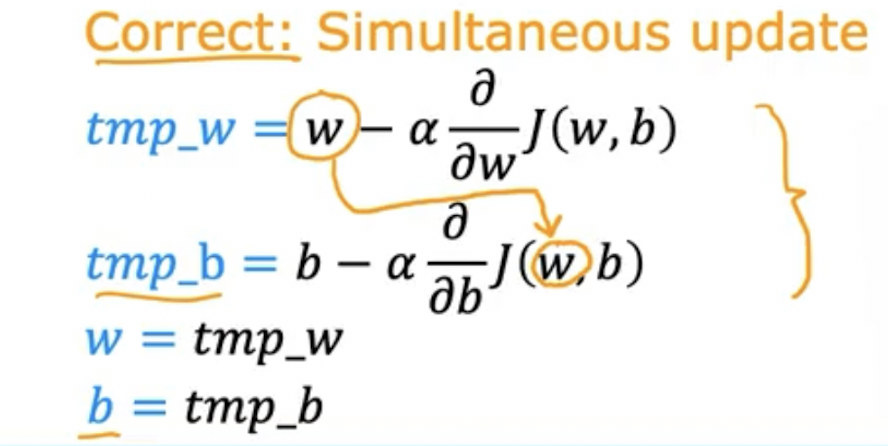

# 20220915

- AI 강좌 필기 정리

---

## Gredient descent
> 경사 하강. 비용함수 최소 weight를 찾는 방법.
- 딥러닝에서도 사용
- local minimum : 그 구간에서의 최소
- global minimum : 전체에서 최소
- 주위를 돌다 가장 가파른 내리막 방향으로 가는 것을 비유
    - 어느 방향을 선택하느냐에 따라 전혀 다른 local minimum이 나올 수 있음.
    - 한 minimum이 선택되면 다른 minimum은 전혀 찾지 못하게 됨.

### 경사 하강 구현

> w와 b를 업데이트 -> 업데이트 결과를 반영
>> w 업데이트 후 적용해서 b 구하면 안됨 (전혀 다른 결과)
- 순서
    .png)
    - 손실함수를 미분
    - 기존 w - 학습률*(미분한 손실함수)
        - 기존 w 값이 minimum일 때 보다 클 경우 우측에 위치하게 됨 -> 기울기 Positive
        - 반대로 minimum일 때 보다 작을 경우 좌측에 위치하게 됨 -> 기울기 Negative

## Learning rate