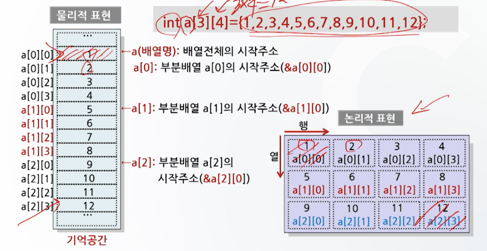

# 배열
## 1차열 배열
- 선언
    - int a[10] : 1차원 배열로, 배열명은 a이고 배열의 크기는 10이며 정수값이 기억됨.
- 기억공간 표현
    - int형으로 4바이트 단위로 5개 기억공간 각각에 사용할 수 있도록 선언됨.
    - array(배열명) : 배열 영역의 **시작 주소**
- 1차원 배열의 초기화
    - 배열선언 후 초기값 할당
    ```c
    int array[4];
        array[0]=10;
        array[1]=20;
        array[2]=30;
        array[3]=30;
    ```
    - 배열선언과 동시에 초기값 할당
    ```c
    int array[4]={10,20,30,40};
    int array[ ]={10,20,30,40};
    int array[4]={10,20,30,  }; // array[3]=0으로 초기화
    int array[4]={10,20,  ,40}; // 에러 발생, 자료개수 달라도 에러
    ```
    - 외부로부터 자료를 입력받아 초기화
    ```c
    int x[10];
        for(i=0; i<10; i++)
    {
        scanf("%d", &x[i]);
    }
    ```


## 2차원 배열
- 선언
    - int a[3][3] = {1,2,3,4,5,6,7,8,9};
    - int a[3][3] = {{1,2,3},
                    {4,5,6},
                    {7,8,9}}
- 기억공간 표현


## 3차원 배열
- 선언
    - int a[2][3][4]={{{1,2,3,4}, {5,6,7,8}, {9,10,11,12}, {13,14,15,16}, {17,18,19,20}, {21,22,23,24}}}

## char형 배열
- 선언
    - char str[12] : 12문자 길이를 가진 char형 배열 (문자열 길이 +1 숫자로 등록)
    - char address[ ]={'s','e','o','u','l','\0'} 
        - 문자 단위로 초기화하는 경우에는 마지막에 널 문자를 삽입해야 함.
    - char name[ ]="HONG GIL DONG"
        - 마지막에 널 문자가 자동으로 들어가 있음. (문자열 단위로 초기화 하는 경우에는 자동으로 추가됨)

## 함수와 배열
- 배열을 함수의 매개변수로 사용할 경우
    - 함수 호출시 배열명만 명시하여 호출
    - 함수의 헤더에는 1차원 배열의 경우 크기 생략 가능. 다차원 배열의 경우 가장 높은 차원의 크기 생략 가능
        - int score[ ][2] ...
