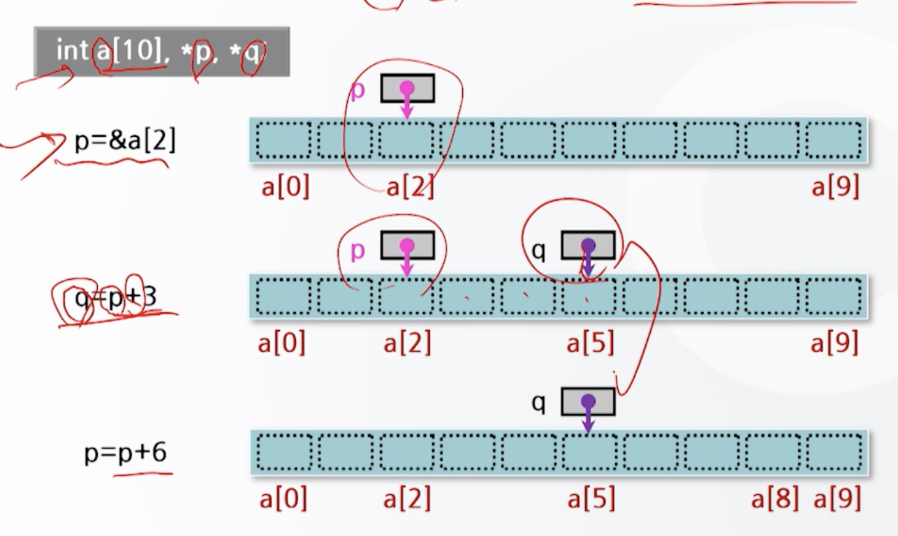

# 포인터

## 개요
- 포인터는 변수의 일종
    - 특정 데이터 값을 가지고 있음
    - 특정 데이터가 저장된 기억장소의 주소값을 가지고 있음.
    - **기억공간을 변수명으로 접근하지 않고 주소로 접근하기 위해서 사용**
- 기존 변수
    - 변수 선언에 의해 기억공간이 할당
    - 할당된 기억공간에 변수에 대입한 데이터가 저장
    - 기억공간에 주소가 부여되어 있음.
- 포인터 = 주소를 이용해 변수와 같은 동일한 작업을 함

## 선언
- 형식 : 자료형 *포인터변수명;
- 사용 예 : int *p;
- 기능 : 변수 p는 포인터 변수로서 정수형의 자료를 갖는 변수의 주소를 갖는다.
    - p : 포인터 변수 (주소를 가짐)
    - *p : 주소에 수록된 자료를 가짐

## 참조
- 잘못된 참조 예
```c
int *p,i = 4;
    *p=i; // 포인터변수 p가 기억공간 내 몇 번지를 가르키는지 알 수 없다.
```
```c
int *p,i = 4;
    *p=5; // 기억공간 어디를 가르키는지 알 수 없다..
```

- 올바른 참조 예
```c
int *p,i=4;
    p=&i;
    *p=10;
``` 
```c
#include <stdio.h>
void main(){
    int *p,i=3,j;
    p=&i; 
    j=*p; // 포인터 변수 p가 가르키는 번지의 내용을 변수 j에 대입
    j++;
    printf("*p = %d\n", *p);
    printf("p = %x\n", p);
    printf("j = %d\n", j);
}
```

## void 형 포인터
- 형식 : void *포인터명;
- 의미
    - 프로그램 실행시에 자료형이 결정되는 경우에 사용
    - 저장하기 전에 명시적 형변환이 필요
- 사용예
```c
#include <stdio.h>
void main(){
    int a = 100;
    char b = 'b';
    void *p = NULL;
    p = (int*)&a;
    printf("*p = %d\n", *(int*)p);
    p = (char*)&b;
    printf("*p = %c\n", *(char*)p);
}
```

## 일반 변수와 포인터 변수의 비교
- 선언 방식 : * 있으면 포인터
- 값 할당 : *포인터명 = 값
- 주소 참조 : 일반변수의 경우 &변수, 포인터변수는 그 자체가 주소
- 주소연산 : 포인터 변수만 연산 가능 (예. a++;, b--;)

## 포인터 연산
- 포인터와 포인터 끼리의 계산이 가능하다.
- 포인터와 기억공간의 대응관계
    - int *p;의 경우 p=100일 때
        - int 4바이트니까 p++하는 경우 *(p+1) -> 104
        - *(p+2) -> 108 ...
    - char *p;의 경우 p=100일 때
        - char 1바이트니까 p++하는 경우 *(p+1) -> 101
        - *(p+2) -> 102 
- 포인터 연산
    - int a[10], *p, *q;
    