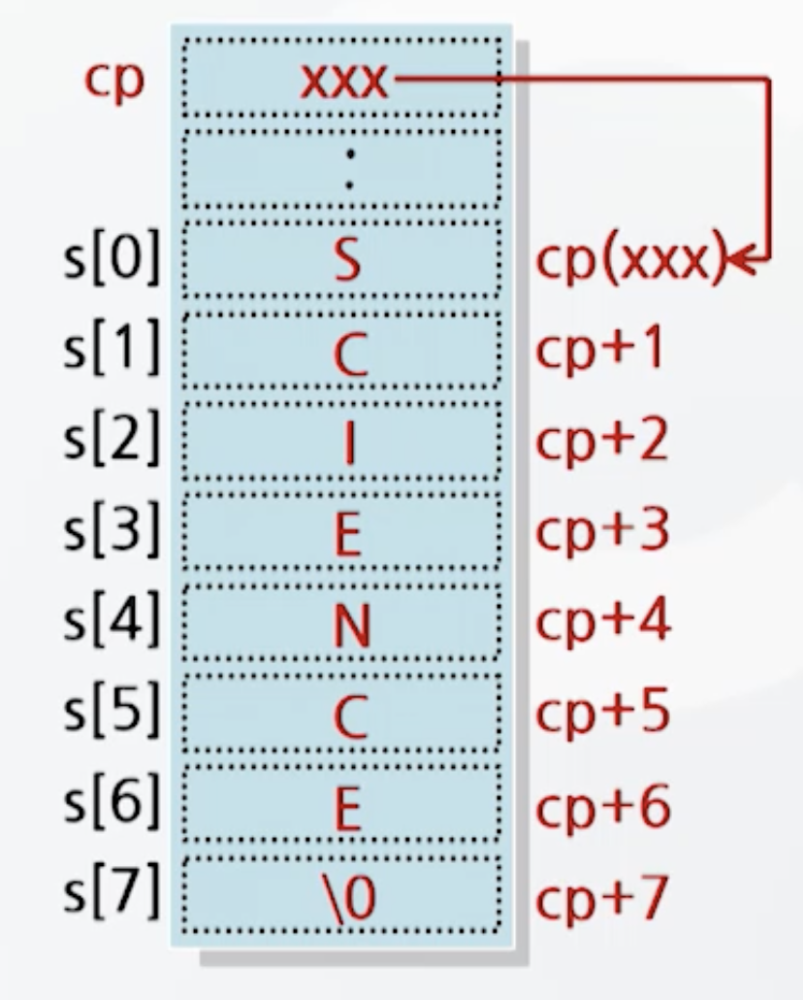
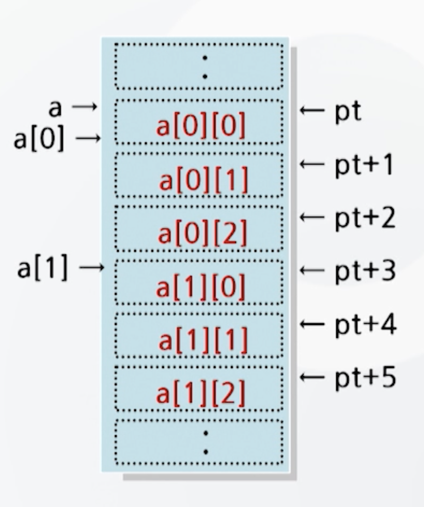

# 포인터 이어서

## char 형 포인터
- 포인터는 문자열 처리에 효과적
- 문자열 처리에 char형 포인터 사용
- 예시
    `char *cp = "COMPUTER";`
    - *cp -> "C" : cp는 문자열의 시작주소를 갖는다. 이후는 *(cp+1), *(cp+2) ...
    - 값을 참조할 때와 달리 포인터변수 cp에 주소를 치환하지 않는다.

```c
#include <stdio.h>
void main(){
    char *cp = "COMPUTER";
    int i=0;
    do
        printf("*(cp+%d) : %c\n", i, *(cp+i));
    while(*(cp+i++) != 0);
}
```

## 포인터와 배열의 관계
- 배열과 포인터의 기억공간 확보
    - 배열 : 기억공간 중 자료영역을 고정적으로 확보
    - 포인터 : 기억공간 중 자료영역을 유동적으로 확보
### 포인터를 이용한 1차원 배열의 참조
```c
char s[ ]="SCIENCE";
char *cp;
cp = s; // 포인터 cp를 이용하여 배열 s의 내용을 참조
```
- 기억공간

- 배열은 포인터의 일부분이다
- 모든 배열은 포인터로 표현할 수 있다.
    - cp+1 <-> &s[1]
    - *(cp+1) <-> s[1]

### 포인터를 이용한 2차원 배열의 참조
```c
int a[2][3];
int *pt;
pt = a;
```
- 기억공간


## 포인터 배열
- 포인터를 배열로 표현하는 것
- 포인터가 여러개 있었을 때 집합형태로 표현
    - 포인터 여러개 사용할 때 포인터 배열로 선언
    - 주로 문자열 배열처리에 사용

- 2차원 배열과 동일
    - 포인터 배열은 자료의 크기만큼 기억공간을 할당하기 때문에 2차원 배열에 비해 기억공간 절약효과를 가짐

## 이중 포인터
- 포인터의 포인터
    - 자료가 있는 곳을 이중으로 가리키는 포인트
- 형식 : int **p;
