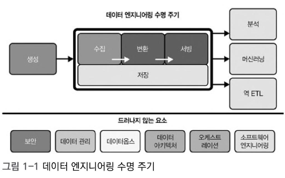

# 견고한 데이터 엔지니어링  
## 1장 요약

> 데이터 엔지니어링이란 무엇이고, 어떻게 진화해왔는가?  
> 그리고 어떤 기술과 역할을 필요로 하는가?

---

# 데이터 엔지니어링이란?

- 데이터를 이동·조작·관리하는 모든 작업  
- 원시 데이터를 가져와 분석/ML 등 다운스트림 사용 사례를 지원  
- SQL 중심 / 빅데이터 중심으로 나뉨  
- 데이터 분석가·과학자가 추가 분석할 수 있도록 데이터 인프라 구축·운영  
> 고품질의 일관된 정보를 생성하는 시스템과 프로세스를 개발·구현·유지하는 역할

---

# 데이터 엔지니어링 수명 주기

- 데이터 생성 → 저장 → 수집 → 변환 → 서빙  
- 이 흐름 아래 보이지 않게 작동하는 **언더커런트(Undercurrent)**:  
  - 보안, 데이터 관리, 데이터옵스, 아키텍처, 오케스트레이션 등  

---

# 데이터 엔지니어의 진화

## 1980-2000  
- 데이터 웨어하우스와 BI  
- 비즈니스 데이터 웨어하우스, MPP 데이터베이스 등장  

---

## 2000s  
- 닷컴 버블 이후 기술기업의 변화: 모놀리식 아키텍처에서 대규모 컴퓨터 클러스터링 기반 분산 연산 및 저장 등장 → 빅데이터 시대의 시작  
- AWS의 EC2, S3, DynamoDB 등장으로 클라우드 인프라 확대  
- 빅데이터 도구들이 활발하게 도입됨  

---

## 2010s  
- 하둡 생태계 발전: 피그(Pig), 하이브(Hive), 드레멜(Dremel), HBase, 스톰(Storm), 카산드라(Cassandra), 스파크(Spark), 프레스토(Presto) 등 다양한 오픈소스 도구 등장  
- 빅데이터 붐과 오픈소스 도구의 대중화에도 불구하고, 실제 운영상에서 많은 관리 오버헤드와 클러스터 유지 비용 발생  
- 빅데이터 용어가 널리 사용되었지만 점차 관리 비용과 복잡성으로 인해 현실적 한계 인식  
- “빅데이터”라는 용어 자체의 가치는 점차 저하, 데이터 엔지니어와 빅데이터 엔지니어 간 경계 희미해짐  

---

## 2020s  
- 데이터 수명주기 전반에 초점  
- 하둡, 스파크, 인포매티카 등 기존 모놀리식 프레임워크에서 분산·모듈화·관리·추상화된 경량 도구 중심으로 이행  
- 모던 데이터 스택 등장(다양한 도구와 워크플로우)  
- 데이터 엔지니어 → 데이터 수명주기 엔지니어로 역할 확대  
- 빅데이터라는 용어보다는 데이터 관리, 통제, 사용 용이성, 품질 향상에 집중  
- 탈중앙화와 민첩성 강조  

---

# 데이터 엔지니어링과 데이터 과학

- 데이터 엔지니어: 데이터 과학자가 사용할 데이터를 제공  
- 데이터 과학자: 데이터를 분석·모델링·실험  
- 서로 다른 역할이지만 상호 보완적  
- DE 덕분에 DS가 데이터 전처리보다 분석에 집중 가능  

---

# 데이터 엔지니어의 기술과 활동

- 데이터 도구 평가·조합·활용 능력  
- 비용·확장성·단순성 고려  
- 도메인 이해 + 커뮤니케이션 능력  
- 데이터 아키텍처 설계 및 유지  

---

# 데이터 성숙도 모델
- 데이터 성숙도: 데이터가 경쟁 우위로 활용되는 방식.  

## 1단계: 시작  
- 빠른 성과·견고한 데이터 기반 구축  
- 기술 부채 최소화·불필요한 복잡성 배제  

## 2단계: 확장  
- 확장성 있는 아키텍처 구축  
- ML 지원·데이터옵스·데브옵스 도입  

---

## 3단계: 선도  
- 자동화·데이터 거버넌스  
- 전사적 데이터 활용·데이터 카탈로그·계보 관리  

# 

> **Q. 다니고 계신 회사의 데이터 성숙도는 어디쯤 위치하는 것 같은지?** 
> **그리고 그렇게 생각한 이유는 무엇인지?**  

---

# 데이터 엔지니어의 역량

- SQL, Python, Java 등 언어 능력 (가상머신 언어 및 Bash 스크립트 포함)  
- 스파크·분산 처리·오케스트레이션 도구 활용  
- 소프트웨어 엔지니어링, 데이터 아키텍처 설계, 데이터옵스 역량  
- 성능 및 비용 최적화 능력  

---

# Abstraction vs Build

- A형: 추상화·기성 제품 중심·단순화  
- B형: 사내 핵심 역량 강화·맞춤형 도구 구축  
- 두 유형 모두 필요하며, 한 명이 겸할 수도 있음  

---

# 조직 내 데이터 엔지니어

- 내부 대면: BI, 보고서, 데이터 과학 지원  
- 외부 대면: IoT, SNS, e-Commerce 등 사용자 데이터 처리  
- 데이터 생산자 ↔ 소비자 허브 역할 수행  
- 경영진·PM·기타 이해관계자와 협업  

---

# 주요 기술 및 비즈니스 관계자 및 협업

- 주요 기술 관계자:  
  - 업스트림 데이터 생산자  
  - 데이터 아키텍트  
  - 소프트웨어 엔지니어  
  - 다운스트림 데이터 소비자 (데이터 과학자, 데이터 분석가, 머신러닝 엔지니어, 인공지능 연구원)  

- 주요 비즈니스 관계자:  
  - 최고경영자(CEO), 최고정보책임자(CIO), 최고기술책임자(CTO), 최고데이터책임자(CDO), 최고분석책임자(CAO), 최고알고리즘책임자(CAO) 등  
  - 프로젝트 매니저, 제품 관리자  

---

- **LG 사례**: 부회장 전용 챗봇 개발 프로젝트  
  - 내부 정보의 외부 API 노출 제한  
  - 내부 정보 검색 및 활용 가능하도록 설계  

# 

> **Q. 현재 본인은 데이터 엔지니어인가? 혹은 다른 기술 관계자인가?** 
> **협업 시 가장 긴밀한 비즈니스/기술 파트너는 누구이며, 어떤 어려움이 있었는가?** 

---

# 기술과 비즈니스 책임

- 커뮤니케이션 및 요구사항 파악, 교육  
- 비용 관리·지속적 학습  
- 큰 그림 이해 + 비즈니스 가치 극대화  
- 성공적인 데이터 엔지니어링은 단순 기술뿐 아니라 협업과 가치를 함께 고려  

---

# 요약

- 데이터 엔지니어링은 단순한 파이프라인 구축을 넘어  
- 데이터 수명 주기 전반과 비즈니스 가치를 잇는 역할  
- 기술적 깊이와 커뮤니케이션 역량 모두 중요  
