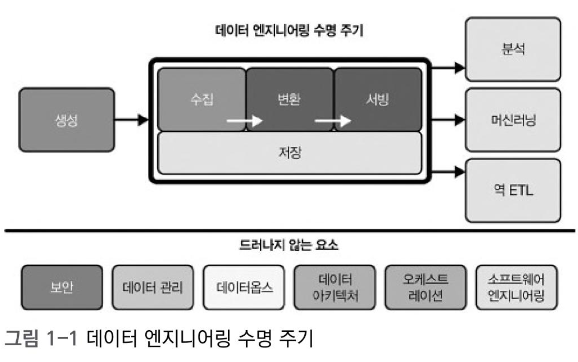

# 견고한 데이터 엔지니어링  
## 2장 요약

> 데이터 엔지니어링 수명 주기  
> 각 단계의 핵심 고려사항과 눈에 보이지 않는 중요한 요소들

---

# 데이터 수명주기 vs 데이터 엔지니어링 수명 주기

- **데이터 수명주기**: 데이터의 생성부터 소멸까지 전체 흐름을 포괄
- **데이터 엔지니어링 수명 주기**: 엔지니어가 주로 제어하는 영역(생성~서빙)에 집중

---

# 데이터 엔지니어링 수명 주기 요약

---

# 1. 데이터 생성

- 원천 시스템: 애플리케이션, IoT, DB 등  
- 데이터 특성 평가: 생성 속도, 스키마 구조(고정 vs 스키마리스), 품질, 중복·지연 가능성  
- 원천 시스템과의 협업·소통 채널 확보 필수  
- 관련 링크: [우아한형제들 배치 처리 파일럿 개발 사례](https://techblog.woowahan.com/2623/)

---

# 2. 데이터 저장

- 클라우드 기반 스토리지 아키텍처 활용이 일반화
- 저장소 선택 시 고려사항:  
  - 성능, SLA, 스키마 진화 가능성  
  - 메타데이터 관리, 보안/컴플라이언스 요구  
- **데이터 온도 개념**:  
  - 핫, 웜, 콜드 데이터로 구분하여 저장 전략 수립 필요

---

# 3. 데이터 수집

- 수집 방식 결정: **배치 vs 스트리밍**
  - 배치: 단순하고 보편적, 예측 가능한 처리에 적합
  - 스트리밍: 실시간성 확보 가능하나 복잡성↑
- **푸시 vs 풀** 모델: 데이터 이동 방식에 대한 전략 수립 필요  
- 참고:  
  - [카카오뱅크의 금융 배치 시스템](https://tech.kakaobank.com/posts/2412-financial-batch-system-with-airflow/)  
  - [Push vs Pull 방식 설명](https://velog.io/@zihs0822/Push-vs-Pull-%EB%AA%A8%EB%8B%88%ED%84%B0%EB%A7%81-%EB%8D%B0%EC%9D%B4%ED%84%B0-%EC%88%98%EC%A7%91-%EB%B0%A9%EC%8B%9D), [FLab Insight](https://f-lab.kr/insight/push-and-pull-models-20250318)

---

# 4. 데이터 변환

- 데이터 형태를 원천 구조에서 분석/ML 친화적으로 변환
- 변환 설계 시 고려사항:
  - ROI(투자 대비 효용)
  - 비즈니스 규칙 준수
  - 단순성과 독립성 확보
- 변환 시점 선택: 수집 시 / 배치 시 / 스트리밍 / 원천 시스템 내부 등 다양

---

# 5. 데이터 서빙

- 데이터는 **사용될 때 가치**를 가짐
- 활용 사례:
  - BI 리포트, 운영 분석, 임베디드 분석
  - 머신러닝 모델 학습/서빙
  - **역 ETL**: 처리한 데이터를 다시 원천 시스템(Google Ads 등)에 공급  
    (예: 광고 입찰가 조정에 활용)

---

# 드러나지 않는 요소 (Undercurrent)

## 보안

- 최소 권한 원칙(Principle of Least Privilege)
- 암호화, 마스킹, 접근 제어 등

## 데이터 관리

- 데이터 거버넌스: 품질, 무결성, 책임, 메타데이터 관리
- 데이터 모델링, 계보 추적, 수명 주기 관리
- 윤리 및 개인정보 보호

---

## 데이터 옵스 (DataOps)

- 목표: 데이터 릴리즈의 안정성·속도·품질 개선
- 핵심:
  - 자동화(CI/CD, 테스트, 데이터 검증)
  - 모니터링 및 관찰 가능성(observability)
  - 장애 대응 및 회복 설계

#

> 특히 **분산 환경, MSA 환경에서의 옵저버빌리티**는 구축 난이도가 높다.  
> 예를 들어 ELK, Prometheus, Grafana 등 로그/메트릭 수집 및 시각화 시스템을 구성할 때,  
> 어떤 로그를 수집하고 어떤 방식으로 모니터링할지 정의하는 설계 능력이 매우 중요하다.

---

## 데이터 아키텍처

- 조직의 현재와 미래 전략을 반영
- 요구사항 충족과 비용·운영 간소화의 균형

## 오케스트레이션

- DAG 기반의 데이터 흐름 제어
- 워크플로우 스케줄링, 에러 핸들링, 재시도 정책
- 주로 배치 중심이지만 스트리밍 기반 오케스트레이션 실험도 증가

---

## 소프트웨어 엔지니어링

- 코어 데이터 처리 로직 개발
- 코드형 파이프라인 (IaC, CDK 등), 오픈소스 도구 제작  
- 스트리밍 시스템, 메시지 브로커와의 연동 등

---

# 요약

- 데이터 엔지니어링 수명 주기는 5단계로 구성된다:  
  **생성 → 저장 → 수집 → 변환 → 서빙**
- 각 단계에는 기술적 선택과 전략적 판단이 필요
- 수명 주기 전반에 걸쳐 드러나지 않는 요소(Undercurrent)를 함께 고려해야  
  → 안정적이며 유연한 데이터 파이프라인 구축 가능
- 특히 모니터링 및 관찰 가능성(Observability)은 구축의 난이도는 높지만,  
  데이터 시스템의 신뢰성과 품질 유지에 있어 핵심적인 요소이다.
