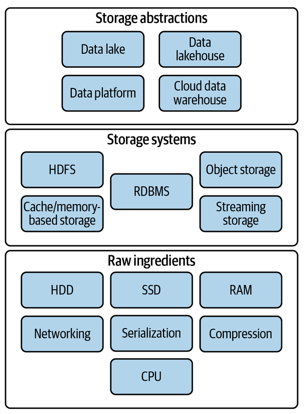

# 견고한 데이터 엔지니어링
## 6장 요약

> 데이터 저장

---

---

# 6.1 데이터 스토리지의 기본 구성 요소

- **자기 디스크(HDD)**
  - 저렴한 GB당 비용, 대용량 저장에 적합
  - 물리적 회전과 헤드 이동으로 인한 지연
  - 50~500 IOPS 수준
- **SSD**
  - 플래시 메모리 기반, 0.1ms 미만 접근 지연
  - 높은 IOPS와 전송 속도
  - GB당 비용이 HDD의 10배
- **RAM**
  - 휘발성, 매우 빠른 속도
  - 캐싱·인덱스·실시간 처리에 활용
  - GB당 약 10달러

---

- **네트워킹 & CPU**
  - 가용성, 내구성, 성능에 영향
- **직렬화**
  - 데이터 전송·저장 시 표준 포맷 변환
  - XML, JSON, CSV 등
- **압축**
  - 저장 공간 절약, 네트워크 전송 효율 ↑
  - CPU 자원 추가 소모
- **캐싱**
  - 자주 접근하는 데이터의 빠른 저장
  - 비용 vs 성능 트레이드오프

---

# 6.2 데이터 스토리지 시스템

## 6.2.1 단일 vs 분산 스토리지
- **단일**: 간단하지만 확장성 한계
- **분산**: 여러 서버에 데이터 분산, 확장성·내구성·고가용성

## 6.2.2 일관성 모델
- **최종 일관성**: 빠른 조회, 대규모 분산에 적합
- **강력한 일관성**: 모든 노드 동기화, 정확성 필요 시 사용

---

## 6.2.3 파일 스토리지
- **로컬 디스크**: 쓰기 후 읽기 일관성, 고급 기능 지원
- **NAS**: 네트워크 기반 공유 스토리지
- **클라우드 파일 시스템**: 완전 관리형, 멀티 VM 사용 가능

## 6.2.4 블록 스토리지
- SSD/HDD 기반, 최소 단위 **블록**으로 데이터 저장
- **RAID**: 내구성·성능 향상
- **SAN**: 네트워크 기반 블록 스토리지
- **클라우드 가상화 블록**: AWS EBS 등
- **로컬 인스턴스 볼륨**: 낮은 지연·높은 IOPS, 휘발성

---

## 6.2.5 객체 스토리지
- 키-값 기반, 모든 형식 데이터 저장 가능
- **OLAP·ML 파이프라인**에 적합
- 버전 관리·스토리지 클래스 지원
- 예: AWS S3, GCS

## 6.2.6 캐시 & 메모리 기반 스토리지
- **Memcached**: 단순 키-값 캐싱
- **Redis**: 다양한 자료형, 지속성 지원

---

## 6.2.7 HDFS
- 구글 파일 시스템 기반
- 데이터·컴퓨팅 결합
- 블록 복제(기본 3개)로 내구성 확보
- Spark 등 최신 엔진과 연계

## 6.2.8 스트리밍 스토리지
- **Apache Kafka** 등
- 장기 데이터 보관·리플레이 지원
- 실시간 분석 가능

---

## 6.2.9 인덱스·파티셔닝·클러스터링
- **인덱스**: 특정 필드 기반 빠른 조회
- **컬럼형 직렬화**: 필요한 열만 스캔, 압축률↑
- **파티션**: 시간·범위 기반 데이터 분리
- **클러스터링**: 파티션 내 데이터 정렬·그룹화

---

