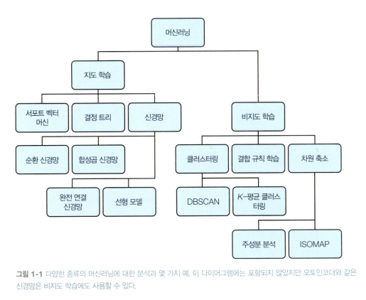
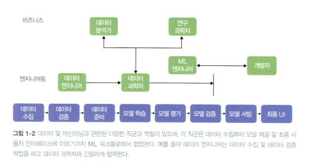

## 이 책의 사용법

- 문제 설명
- 표준 솔루션
    - 해당 솔루션을 선택하는 이유
- 트레이드오프와 대안
-> 코드와 함께 보기

## 관련 용어

### 모델과 프레임워크

### 데이터와 특성 가공
- 데이터
    - 학습, 검증, 테스트용 데이터셋 분할
    - 구조화된 데이터
        - 수치형 / 범주형 데이터
    - 비구조화된 데이터
        - 텍스트, 이미지, 비디오, 오디오 등
- 특징 가공 (Feature Engineering) == 전처리
    - 수치형 데이터 외의 데이터 전처리 필요
- 인스턴스, 학습 예제, 라벨

| 개념 (Concept) | 정의 (Definition) | 특징 (Characteristics) | 예시 (Example) |
| --- | --- | --- | --- |
| **인스턴스 (Instance)** | 예측을 위해 **모델에 입력하는 데이터 항목** 하나 | 라벨(정답)이 없는 단일 데이터 항목 | 테스트 데이터셋의 한 행, 예측할 이미지, 분석할 텍스트 문서 |
| **학습 예제 (Training Example)** | 모델 학습에 사용되는 **데이터 항목 하나** | 인스턴스 (데이터) + 라벨 (정답)이 모두 포함됨 | '요일', '도시' 등의 인스턴스와 '여행 기간' 라벨이 결합된 데이터 한 줄 |
| **라벨 (Label)** | 모델이 **예측하고자 하는 대상**이자, 학습 데이터의 **정답 값** | 모델의 예측값과 비교하는 기준 | 타임스탬프 예시의 '여행 기간', 스팸/정상 분류에서의 '스팸' 여부 |

- 데이터 검증
    - 데이터 통계 계산 : 특징들 균형잡힌 표현이 포함되어있는지
    - 스키마 이해 : 데이터 유형 정의. 누락값 식별 등
    - 데이터셋 평가해 데이터에 내재된 문제 식별 : 학습 데이터셋과 테스트셋 품질에 영향을 미칠 수 있는 불일치를 식별

### 머신러닝 과정
0. 데이터 수집, 특징 가공
1. 학습
2. 모델 평가

- 1, 2를 여러번 실행해 특성 가공을 추가로 수행하고 모델 아키텍처 조정

3. 평가를 통해 모델 성능 만족했다면 모델 서빙(제공)
    - 예측 : 모델의 output. 미래 가치 추정 ex. 추천시스템 등
        - 온라인 예측 : 실시간으로 적은 수의 예측값을 얻고자 사용
        - 배치 예측 : 오프라인에서 대규모 데이터 집합의 예측을 얻고자 사용
    - 추론 : 모델의 output. 현재 데이터 분석 ex. 텍스트 긍/부정 감정분석

4. 프로덕션 파이프라인 구축
    - 위의 0,1,2 프로세스는 프로덕션 파이프라인과 별도로 처리
    - 모델 새버전 학습을 위한 0 단계가 있으면 -> 모델 다시 평가 
    - 이걸 자동화하기 위한 시스템이 머신러닝 파이프라인

### 데이터와 모델 도구
- 빅쿼리
- AI Platform Training: 구글 클라우드에서 머신러닝 모델을 학습하기 위한 인프라를 제공
- AI Platform Prediction: 학습된 모델을 배포하고 API를 사용하여 모델의 예측을 생성

### 관련 직군
- 데이터 과학자 : 데이터셋 수집, 해석, 처리 수행
    - 통계적, 탐색적 분석 수행
- 데이터 엔지니어 : 데이터 인프라와 워크플로 관리
- 머신러닝 엔지니어 : 데이터 과학자가 개발한 모델을 가져와서 해당 모델의 학습, 배포와 관련된 인프라와 운영을 관리
    - 모델을 업데이트하고, 모델 버전을 관리하고, 최종 사용자에게 예측 서빙을 처리하는 프로덕션 시스템을 구축

## 머신러닝의 문제

### 1. 데이터 품질
- '쓰레기가 들어가면 쓰레기가 나온다' garbage in, garbage out
- 데이터 품질 판단을 위한 요소. 정확도, 완전성, 일관성, 적시성
1. 정확도
    - 특징과 라벨의 정확도. 오타, 중복항목, 단위 불일치 등
2. 완전성
    - 모든/다양한 케이스를 포함하고 있는지.
3. 일관성
    - 편견 없는 일관된 결과 반환을 위한 데이터 준비
    - 데이터셋 작업 절차에 표준이 있어야함. 
4. 적시성
    - 사건 발생 시점과 DB 추가 시점 사이 지연시간
    - 실시간 (온라인 예측)이 필요한 데이터는 민감한 사안임
    - 사건 발생과, 추가 시점을 모두 기록하여 둘간의 차이를 새로운 특징으로 추가하는 방법으로 극복할 수 있음

### 2. 재현성
- 모델은 기본적으로 무작위. 
    - 훈련 전 가중치가 임의의 값으로 초기화됨.
    - 다른 가중치로 훈련 시작한 경우, 학습이 끝난 서로 다른 모델은 다른 결과를 생성함.
    - 이는 결론적으로 재현성 문제 야기.
- 프로그램 시작 부분에서 seed를 고정할 수 있음. 
- 프레임워크 버전별로 다른 랜덤값을 고정할 수 있기 때문에 버전 표준화 필요

### 3. 데이터 드리프트
- 시간이 지나면서 더 많은 데이터를 관측할 수 있게됨
- 이에 따른 요인을 함께 고려해, 시간이 지남에 따라 쓸 만한 특징이 늘어나는 데이터 셋을 처리하는 방법을 알기

### 4. 확장
- 머신러닝 워크플로우의 확장성 문제
1. 데이터 수집 및 전처리
2. 모델 학습 : 유형에 따른 인프라 상이
3. 모델 서빙 (배포 및 예측) : 모델 요청의 수가 상이

### 5. 다양한 목표
- "성공적인 모델"을 정의하는 방식이 목적에 따라 달라짐.
- 조직 내 각 팀의 요구사항이 모델과 어떻게 관련되는지 고려하기

## 마치며
디자인 패턴은 전문가의 지식과 경험을 모든 실무자가 따를 수 있는 조언으로 코드화하는 방법이다.
이 책에서는 각 디자인 패턴에서 머신러닝 시스템을 설계, 구축, 배포할 때 일반적으로 발생하는 문제에 대한 모범 사례와 솔루션을 정리하였다. 

<!-- 43p 끝! -->