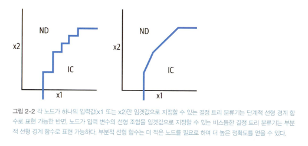

<!-- 43p~ -->

# 서론

머신러닝 모델은 특정 유형의 데이터로만 작동하도록 정의된 "수학적 함수"
-> 수학적 함수에 맞게 데이터 처리 필요

## 결정 트리 모델
특정 기준에 참/거짓을 분기점으로 삼는다.  
- 참 거짓으로 분할하기 위한 새로운 함수를 만든다.
- 특정 기준 이상/이하인 경우 이를 참이라고 정의한다.  
등의 방법으로 데이터 표현을 변형한다. (일반적으로 모델이 직접 각 분기점에 해당하는 기준치를 정한다.)

## 용어 설명
- 입력 모델에 제공하는 실제 데이터
- 특징 : 모델이 실제로 계산하는 변환된 데이터
- 특징 가공 : 입력 데이터를 표현하는 특징을 생성하는 과정. 특징 가공은 데이터 표현을 선택하는 방법.
- 특징 추출 : 입력 데이터를 표현하기 위해 특징을 학습하는 과정. 
    - 임베딩 : 심층 신경망이 스스로 학습할 수 있는 데이터 표현의 정형화 방식

## 특징 교차
> 데이터 표현시에 입력 변수를 하나만 사용할 필요는 없음.
- 결정 트리의 경우 2개 이상의 입력 변수의 선형 조합을 임곗값으로 설정하여 불리언 특징을 만든다.

- 이와 같이 부분적으로 선형 함수를 표현해 더 적절하게 학습할수도 있다. 
- 이 아이디어를 확장한 것이 특징 교차 디자인 패턴으로 **여러 값을 가지는 카테고리형 변수간의 AND 관계 학습**을 단순화한다.

## 특징 해시
> 학습하지 않고 비 고정적이어도 특징 해시로 데이터 표현을 할 수 있다. 
- 특징 해시를 사용하면 특징 입력이 취할 수 있는 잠재적 값을 몰라도 된다. 

## 멀티 모달 입력
- 서로 다른 유형의 입력 데이터를 사용

---

# 2.1 간단한 데이터 표현

## 2.1.1 수치 입력
- 스케일링이 필요한 이유 : 상당수의 ML 프레임워크는 [-1, 1] 범위 내의 수치에서 잘 작동하도록 조정된 옵티마이저를 사용.
    - 입력값이 해당 범위에 속하도록 수치를 스케일링
    - 경사하강법 옵티마이저는 손실 함수 곡률이 증가함에 따라 수렴하는데 더 많은 단계를 필요로 함. 가중치 업데이트가 큰 경우 계산 부하가 증가. 해당 방식으로 스케일링 하면 손실 함수가 더 완만해지고 더 빨리 수렴하는 경항이 있음.
    - 일부 머신러닝 알고리즘이 서로 다른 특징의 상대적인 크기에 민감한 경우가 있음. (k-means clustering 등)

### 선형 스케일링
- min-max `x1_scaled = (2*x1 - max_x1 - min_x1)/(max_x1- min_x1)`
- z-score `x1 scaled = (x1 - mean_x1)/stddev_x1`
- clipping : 특정 범위 이상, 이하 값을 1, -1 값으로 치환함 ([관련 링크](https://swrush.tistory.com/592))
- -> winsorizing : 클리핑에서 특정 범위를 백분위수 (5% 내외) 경계로 선정

### 비선형 변환
- 스케일링 전에 입력값에 변환주기
    - 로그 변환, 다항식 전개 (제곱, 제곱근, 세제곱, 세제곱근 등)
    - 시그모이드 함수
- 분포를 정규 분포, 균일한 분포로 보이도록 하는 방법
    - 히스토그램 평준화 : 버킷화 하여 원하는 출력 분포에 맞는 버킷 경계를 선택 (히스토그램의 분포를 평탄하게 만듦)
    - 박스-콕스 변환 (모수 변환 기술): 분산을 동일하게 만들기 위한 방법으로 특정 람다 함수를 정의해서 정규분포에 가까운 모양의 분포로 변형하도록 최적 람다를 찾는 방법 ([관련 링크](https://seeyapangpang.tistory.com/35#google_vignette))

## 2.1.2 카테고리 입력

- 원-핫 인코딩 : 특징 벡터로 변환 (예시: 요일 변환)
    - 수치 입력이 인텍스인 경우 사용
    - 입력과 라벨 관계가 연속적이지 않은 경우
    - 수치 변수를 버킷화 하는것이 유리할 때 카테고리형으로 변환 -> 원핫인코딩

- 카테고리 변수의 배열
    - 각 어휘 항목 발생 횟수를 세서 표현
    - 상대 빈도를 사용 (전체를 1로 두고 해당 비율을 기록)
    - 배열이 특정 방식을 통해 정렬된 경우 마지막 3개 항목을 입력 배열 표현. (짧은 경우에는 결측값으로 3개를 맞춰 채우기)
    - 전체적인 통계로 배열을 표현
