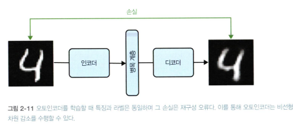

<!-- 57p -->

# 2.2 디자인 패턴 1: 특징 해시

## 문제
- 불완전한 어휘 : 병원의 일련번호, 담당의사 ID 등이 카테고리로 사용되는 경우
- 카디널리티로 인한 모델 크기 : 위와 같은 예시는 높은 카디널리티로 모델이 커질 수 있음
- 콜드 스타트 : 새로운 병원, 의사 고용 같은 경우 기존 모델이 예측하기 어려움

## 솔루션
1. 카테고리 입력을 문자열로 변환
2. 문자열에 대한 결정론적 및 이식 가능한 해시 알고리즘(대표적으로 팜 핑거프린트) 호출
3. 해시 결과를 원하는 버킷 수로 나누고 나머지를 취하기

## 작동 원리
- 어휘 외 입력 : 학습 데이터에 없어도 해시된 특징값을 받을 수 있음. 버킷은 수많은 카테고리 데이터를 정해진 몇 개의 그룹으로 묶어주는 그릇. 모델은 개별 데이터가 아닌 이 그룹(버킷)의 특징을 학습함으로써, 메모리를 아끼고 처음 보는 데이터에도 유연하게 대처할 수 있게 됨. 해당 버킷의 수를 잘 선택해서 사용하는 것이 필요.
- 큰 카디널리티 : 모든 케이스를 수치로 변형하는 것이 아니라서 해겨로디지만 너무 적은 해시 버킷 수는 손실이 발생할 수 있음
- 콜드 스타트 : 해시 버킷에서 예측을 가져와서 일부 해결된다.

## 트레이드오프와 대안
- 버킷 충돌 : 동일한 버킷값이어도 되는 경우에만 특징 해시 사용 가능. 
- 왜도 : 높은 경우에 정확도 손실이 심각해짐. 

- 대안
    - 특징 집계 : 버킷 수가 너무 적어 버킷 충돌 생기거나, 왜도가 높은 경우 모델에 대한 입력으로 특징 집계를 사용하는것이 도움이 될 수 있음. 
    - 하이퍼파라미터 튜닝 : 버킷 수를 결정할 때 하이퍼파라미터로 취급해 조율

- 암호화 해시 X : 핑거프린트 해시 + 나머지 연산으로 특징 해시를 사용할 것.
    - 그냥 나머지 연산 없이? -> 가짜 상관관계 문제 : 우연히 같은 패턴을 가진 문자열로 데이터를 학습. 본질적인 문제와 상관없이 문자열 패턴으로 학습된 예측 결과는 해싱 방법이 생성한 우연한 패턴을 학습할 수 있음.
    - MD5 같은 암호화 해시? 보통 암호화 해시는 솔트가 들어가서 값이 항상 같지 않음(비결정론적). 일부러 계산 느리게 구현함. 단방향 해시이므로 서로 다른 입력이 같은 결과를 낼수도 있음. (암호화 해시의 특징)

- 연산의 순서 중요
- 빈 해시 버킷 : 버킷 중 하나가 비어있을 수 있음. 그렇기 때문에 해시된 특징 열을 사용할 때 빈 버킷과 관련된 가중치가 거의 0이 될 수 있게 L2 정규화 사용하는 것이 좋다.

<!-- 66p -->

# 2.3 디자인 패턴 2: 임베딩

## 문제
- 머신러닝 모델의 학습 데이터는 카테고리형, 텍스트, 이미지, 오디오, 시계열 등의 형태를 가질 수 있음.
- 머신러닝 모델에 제공할 수치로 된 특징값으로 변환해야함.
- 임베딩은 항목 간의 유사성을 유지하는 방식으로 이질적 데이터의 유형들을 처리할 수 있음

## 솔루션
- 임베딩 디자인 패턴은 입력 데이터의 밀착도를 낮은 차원에서 표현함 
    - 큰 카디널리티인 경우 고차원으로 변환하는게 일반적인 방법(원핫인코딩 등)
    - 하지만 이 방법은 비효율적(카디널리티에 따라 데이터 하나 표현하는데 많은 숫자 필요할수도 있음)이고 무의미(해당 정보가 가까운지 먼지 알수가 없음. 예를 들어 원핫인코딩은 run 이랑 walk는 가깝게 apple은 멀게 표현하기가 어려움)
    - 그래서 임베딩을 활용하면 저차원 공간의 실수 벡터로 밀집시켜 표현함. 맥락이 유사한 것을 가까운 임베딩 좌표로 훈련시키는 것이기 때문.
- 임베딩 모델링 대신 저차원 표현 클러스터링 기술인 PCA 같은 방법을 사용할 수 있음
- 임베딩 모델은 경사 하강법으로 학습할 수 있음. 임베딩은 원-핫 인코딩된 저밀도 벡터를 R2의 고밀도 벡터로 매핑함.
```python
plurality = tf.feature_column.categorical_column_with_vocabulary_list(
'plurality', ['Single(1)', 'Multiple(2+)', 'Twins(2)',
'Triplets(3)', 'Quadruplets(4)', 'Quintuplets(5)'])
plurality_embed = tf.feature_column.embedding_column(plurality, dimension=2)
```

### 텍스트 임베딩
- 임베딩 계층을 사용하기 유리함. 유사 단어는 가깝게, 관련 없는건 멀게 훈련하면 됨.
- 훈련 방식
1. 데이터 전처리 (텍스트 -> 정수 시퀀스)
    1) 토크나이저 객체를 생성하고 **어휘집**(각 단어에 고유한 정수 인덱스를 매핑)을 만듦
    2) 실제 텍스트 문장에서 각 단어들을 **어휘집**에서 찾아 숫자로 변경(시퀀스 변환)
    3) 신경망 모델이 훈련할 수 있게, 가장 긴 문장의 시퀀스 길이에 맞춰 나머지 시퀀스들을 특정 값으로 채우는 패딩작업 진행
2. 모델 구성
    1) 임베딩 계층은 각 문장을 (MAX_LEN, output_dim) 크기의 벡터 시퀀스로 변환
    2) 이 벡터들의 평균을 구함 (순서를 무시하고 단어의 의미만 고려하는 '단어 주머니(BOW)' 방식)
    3) Dense 계층 (분류기)을 마지막에 추가하여, 이 평균 벡터를 바탕으로 최종 예측(예: 기사 카테고리 분류)을 수행
3. 모델 학습 (가중치 최적화)
    - 모델이 최종 예측(분류)을 더 잘하도록 손실(loss)을 줄여나가는 과정에서, Embedding 계층 내부의 가중치(벡터 값)들도 함께 최적화(학습)

### 이미지 임베딩
- CNN 모델을 통해 이미지셋을 학습하고 마지막 소프트맥스 계층을 모델에서 제거하면 이를 임베딩 모델로 사용할 수 있음
- 여기에 핵심 컨텍스트를 담은 임베딩 벡터가 생성되고 마지막 계층에서 분류하는것임
- 이 특징 벡터가 이미지에 정보를 포함하고 있어 입력 이미지의 저차원 임베딩에 해당함

## 작동 원리
- 학습된 임베딩을 사용하면 N개의 개별 카테고리 사이의 고유한 유사성을 추출할 수 있으며, 수치 벡터 표현이 있다면 카테고리형 특징 간의 유사성을 정확하게 정량화할 수 있음음
- 유사성을 기반으로 추천 제안 등 다양한 방식으로 전이학습 할 수 있음

## 트레이드오프와 대안
- 임베딩 사용의 단점은 데이터 표현이 손상된다는 점

- 임베딩 차원의 선택
    - 큰 차원을 선택하면 당연히 표현할 수 있는 값이 더 많아짐. 작으면 많이 손실되겠지. 그대신 또 큰 만큼 임베딩 특징 각각의 중요성이 줄어들거나 오버피팅 될 수 있음. 
    - 차원 선택 규칙 
        1) 고유한 카테고리형 원소 총수의 네제곱근을 사용한다(https://oreil.ly/ywFco). 
        2) 임베딩 차원이 고유한 카테고리형 원소 총수 제곱근의 약 1.6배여야 한다(https://oreil.ly/github-fastai-2-blob-fastai-2-tabular-model-py).
        3) 1에서 나온 값과 2에서 나온 값의 사이값으로 하이퍼파라미터 튜닝해서 적절한 값찾기

- 오토인코더
    - 텍스트 임베딩처럼 **어휘집** 사용하는 라벨 지정 방식이 있으나 이런 라벨값을 모두 지정하기 어려운 경우에 사용하는 방법
    
    - 해당 이미지처럼 병목 계층을 임베딩 계층으로 두고, 병목 계층 전 인코더는 고차원 입력을 저차원으로 매핑시키고 병목 계층 후 인코더는 저차원 입력을 고차원으로 다시 매핑한다. 모델은 재구성을 하는데 생기는 오류에 대해 손실 함수를 구성해 해당 손실이 최소화되도록 모델을 훈련한다. 해당 방식은 입력 출력이 동일하여 추가 라벨이 필요하지 않다.
    - 오토 인코더를 이용해 라벨이 매우 적은 데이터 훈련은 다음과 같이 진행한다.
        1) 라벨 없이 특징 압축하기 (오토인코더) : 입력이미지 -> 압축 -> 복원 과정을 통해 모델의 인코더 (압축) 모델을 만듦
        2) 라벨로 실제 예측하기 : 위에서 만든 인코더에 이미지를 넣어 임베딩 추출 -> 이 임베딩을 기반으로 분류 모델 등을 만듦
        - 모델은 더 낮은 차원에서 가중치를 학습하면 되므로 모델 성능을 높일 수 있음

- 콘텍스트 언어 모델
    - 텍스트 보조 학습 작업. Word2Vec, BERT 같은 마스킹된 언어 모델.
    - 정답은 없지만 인터넷에서 가져온 대량의 텍스트 원본으로 데이터 스스로 가짜 문제를 풀게하면 이 문제를 풀면서 저절로 단어의 의미와 문맥을 학습하게 함.
    - Word2Vec : 문장에서 단어를 골라 그 주변에 올 단어들을 예측하게 함(혹은 그 반대)
    - BERT : 빈칸 채우기 & 문장 순서 맞히기. 문장에 일부러 마스크를 뚫어놓고 맞추게 함 / 두 문장을 주고 이 두 문장이 이어질 수 있는지 맞히게 함. 
    - 이제 이 두 사전학습된 모델을 바탕으로 고품질 임베딩을 확보함.

- 데이터 웨어하우스에서의 임베딩
    - 구조화된 데이터 외에도 텍스트와 이미지를 함께 다루는 경우가 많으므로, 데이터 웨어하우스에는 텍스트는 열로, 이미지는 파일 URL로 저장함.
    - 머신러닝 활용을 위해 텍스트나 이미지의 임베딩 벡터를 배열 형식으로 미리 저장해두면 비정형 데이터도 쉽게 통합 가능.
    - 빅쿼리에서는 텐서플로 허브나 스위블 같은 사전 학습된 모델을 로드할 수 있음
    ```sql
    CREATE OR REPLACE MODEL advdata.swivel_text_embed
    OPTIONS(model_type='tensorflow', model_path='gs://BUCKET/swivel/*')
    ```
    - 자연어 텍스트 열을 임베딩으로 변환하고 임베딩 조회 테이블을 새 테이블로 저장
    ```sql
    CREATE OR REPLACE TABLE advdata.comments_embedding AS
    SELECT
        output_0 as comments_embedding,
        comments
    FROM ML.PREDICT(MODEL advdata.swivel_text_embed, (
        SELECT comments, LOWER(comments) AS sentences
        FROM bigquery-public-data.noaa_preliminary_severe_storms.wind_reports
    ))
    ```