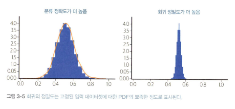
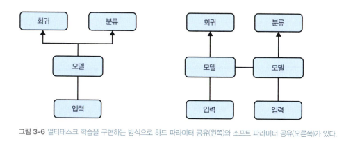

<!-- 113p~ -->

## 3.1 디자인 패턴 5: 리프레이밍
> 머신러닝 문제의 출력 표현 바꾸기

### 문제
- 머신러닝 가설 설정의 첫번째 단계는 어떤 문제인지 프레이밍 하는것
- 회귀 모델 할지 분류 모델 할지... 수치형 변수여서 반드시 회귀분석 할 필요는 X

### 솔루션 
- 수치형 변수를 멀티클래스 분류하여 분류 문제로 리프레이밍 할 수 있음
- 반대로 이진 분류 문제를 확률 예측, 즉 회귀 문제로 리프레이밍 할 수도 있음

### 작동 원리
- 수치 -> 분류로 수정시 정밀도는 약간 떨어지지만 확률 밀도 함수를 알 수 있음 (전체 확률 분포)
    - 즉 정확한 예측값 대신, 다른 구간의 확률도 캐치할 수 있다는 것. 
    - 그럼 복잡한 현실 문제도 반영할 수 있다. 예를 들자면 바이모달 분포(다봉 분포)의 경우 분류로 수정하면 발견할 수 있고 수치로 하면 그 사이 평균값으로 예측할 것임

- 불확실성 포착하기
    - 예측 범위가 넓고 (정규분포 곡선이 넓고), 입력값에 따른 변화 폭이 심할수록 리프레이밍 중요
- 목표 변경
    - 분류 문제를 회귀 문제로 리프레이밍 한 경우
        - 영화 추천 : 특정 영화를 좋아하는 사람은 어떤 특성을 가졌는지(User Space) 숫자 벡터로 예측
        - 예: [연령대: 30.5, 소득 수준: 0.7, 예술영화 선호도: 0.9, 액션 선호도: 0.2]
        - 이를 통해 유연한 추천을 하여 벡터간의 거리 계산으로 추천해줌

### 트레이드오프와 대안
- 리프레이밍 기법을 사용하면 데이터의 한계나 라벨 편향이 생길 수 있음

- 버킷화된 출력
    - 아주 정확한 예측보다 적당한 오차 허용
- 불확실성을 포착하는 다른 방법
    - 회귀 작업 수행시 분류 모델보다 더 많은 데이터가 필요 (그래야 모델이 예측할 수 있음)
- 예측의 정밀도

- 예측 범위 제한하기
    - 활성화 함수 계층을 범위가 [0.1]인 시그모이드 함수(일반적으로 분류 문제에서 많이 사용)로
만들어 마지막 계층의 스케일을 원하는 범위의 값으로 지정
- 라벨 편향
    - 비즈니스 목표에 적합한 가설을 세워야함. 전혀 생뚱맞은 결과를 찍을 수 있음
- 멀티태스크 학습
    - 손실 함수를 두개 이상 사용해서 회귀, 분류 모델 등을 두개 이상 사용하여 예측하는 방법
    - 하드 파라미터 공유 / 소프트 파라미터 공유

