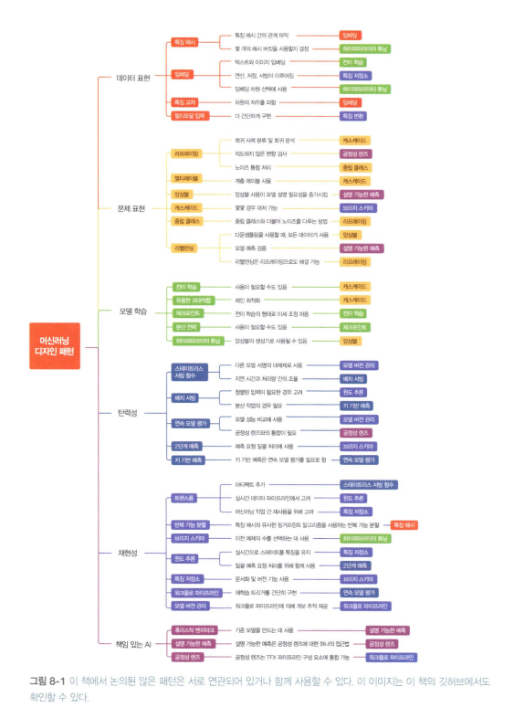

<!-- 433p 시작! -->

> **사전 학습내용**  
> 입력 표현과 모델 선택  
> 일반적인 모델 학습 루프를 어떻게 수정할지   
> 추론을 탄력성 있게 만드는 패턴  
> 책임있는 AI 구현

## 패턴 참조

### 1. 데이터 표현
| 패턴                             | 언제 사용하는가                                             | 핵심 아이디어                              | 장점                            | 한계                          |
| ------------------------------ | ---------------------------------------------------- | ------------------------------------ | ----------------------------- | --------------------------- |
| **특징 해시 (Feature Hashing)**    | 카테고리 값이 너무 많거나, 새로운 값이 자주 등장할 때                      | 문자열을 해시 함수로 숫자 버킷에 매핑                | 차원 수를 제어, 새로운 값 처리 가능, 일관성 유지 | 다른 값이 같은 버킷에 들어갈 수 있는 충돌 발생 |
| **임베딩 (Embedding)**            | 카테고리 값이 많고, 값들 간의 **유사성**까지 학습하고 싶을 때                | 학습을 통해 카테고리를 저차원 연속 벡터로 매핑           | 고차원 데이터를 압축, 의미·유사성 보존        | 학습 과정 필요, 벡터 해석이 어려움        |
| **특징 교차 (Feature Crossing)**   | 단순 모델이 특징 간의 관계를 잘 못 배울 때                            | 둘 이상의 특징을 조합해 새로운 특징 생성              | 특징 간 관계를 명시적으로 반영, 학습 용이      | 조합이 많아지면 차원 폭발, 도메인 지식 필요   |
| **멀티모달 입력 (Multimodal Input)** | 어떤 데이터 표현을 써야 할지 모호할 때, 또는 서로 다른 유형의 데이터를 함께 쓰고 싶을 때 | 가능한 여러 표현(이미지·텍스트·임베딩 등)을 모두 연결하여 입력 | 다양한 시각의 정보 결합, 보완 효과, 범용성     | 입력 차원과 계산량 증가, 데이터 정렬 필요    |

- 불완전한 어휘: 학습 데이터에 없는 새로운 값이 등장할 수 있음.
- 높은 카디널리티: 서로 다른 값이 너무 많아 차원이 커짐 → 메모리/연산 부담.
- 콜드 스타트: 처음 보는 값에 대해 모델이 학습된 정보가 없음.

### 2. 문제 표현
| 패턴                         | 언제 사용하는가                                                                | 핵심 아이디어                                     | 장점                         | 한계                                |
| -------------------------- | ----------------------------------------------------------------------- | ------------------------------------------- | -------------------------- | --------------------------------- |
| **리프레이밍 (Reframing)**      | 문제의 출력 형식이 모델 학습에 맞지 않거나, 더 나은 성능을 위해 다른 방식으로 표현할 필요가 있을 때 (예: 회귀 → 분류) | 문제를 다른 표현으로 변환 (ex. 가격 예측을 가격 구간 분류로 바꿈)    | 문제 단순화, 다른 학습 방법 활용 가능     | 원래 문제와의 해석 차이, 정보 손실 가능           |
| **멀티라벨 (Multi-Label)**     | 하나의 데이터가 여러 개의 라벨을 가질 수 있을 때 (예: 영화 장르: 액션+코미디)                         | 라벨을 멀티-핫 벡터로 인코딩하고, 각 라벨에 독립적인 시그모이드 출력을 사용 | 복합적 라벨 표현 가능, 실제 상황에 적합    | 라벨 간 관계 고려 부족, 라벨 수 많을수록 복잡       |
| **앙상블 (Ensemble)**         | 단일 모델로는 과적합/편향/분산 문제를 해결하기 어려울 때, 데이터가 크지 않을 때                          | 여러 모델의 예측을 결합하여 최종 결과 산출 (배깅, 부스팅, 스태킹 등)   | 성능 향상, 일반화 능력 증가           | 계산량 증가, 해석 어려움                    |
| **캐스케이드 (Cascade)**        | 문제를 단계별로 쪼개 처리하는 것이 효율적일 때 (예: 사람 얼굴 검출 → 특징 분석 → 감정 분류)                | 모델을 연속된 파이프라인으로 구성하여 순차적으로 문제 해결            | 복잡한 문제를 작은 단계로 나눔, 유지보수 용이 | 단계 앞에서 오류 발생 시 뒤까지 영향, 드리프트 관리 필요 |
| **중립 클래스 (Neutral Class)** | 명확히 구분하기 어려운 라벨이 있을 때 (예: 예/아니오 대신 예/아니오/아마도)                           | 불확실한 경우를 별도의 클래스로 추가                        | 애매한 데이터 처리 가능, 모델 안정성 ↑    | 모델 해석 복잡, 데이터 분포 왜곡 가능            |
| **리밸런싱 (Rebalancing)**     | 데이터셋이 불균형할 때 (예: 사기 거래 1%, 정상 거래 99%)                                   | 업샘플링, 다운샘플링, 클래스 가중치 적용                     | 소수 클래스 성능 향상, 불균형 문제 완화    | 샘플링 시 정보 손실·잡음 유입 가능, 과적합 위험      |

### 3. 학습 모델 수정
| 패턴                                     | 언제 사용하는가                                                                           | 핵심 아이디어                                                | 장점                         | 한계                                             |
| -------------------------------------- | ---------------------------------------------------------------------------------- | ------------------------------------------------------ | -------------------------- | ---------------------------------------------- |
| **유용한 과대적합 (Useful Overfitting)**      | 물리 법칙 기반 모델, 시뮬레이션 모델처럼 본래 시스템과 강하게 연결된 문제에서, 데이터 일반화보다 해당 데이터에 “정확히 맞는” 모델이 필요할 때 | 의도적으로 과대적합을 허용하여 학습 데이터를 최대한 맞춤                        | 물리적 제약 조건 반영, 데이터와의 오차 최소화 | 일반 데이터에는 적용 불가, 새로운 상황에 약함                     |
| **체크포인트 (Checkpointing)**              | 학습 시간이 길고 중간에 실패 가능성(서버 다운, 하드웨어 장애 등)이 있는 경우                                      | 모델 학습 상태(가중치, 옵티마이저 상태 등)를 주기적으로 저장해두고 필요 시 이어서 재개     | 학습 안정성 ↑, 시간·자원 절약         | 저장·복구 비용 발생, 저장 주기가 길면 손실 가능                   |
| **전이 학습 (Transfer Learning)**          | 학습 데이터가 부족하거나 처음부터 학습하기 어려운 복잡한 모델을 다룰 때                                           | 다른 유사한 데이터셋으로 사전 학습된 모델의 가중치를 가져와 일부 계층은 고정하고 나머지만 학습  | 적은 데이터로도 성능 향상, 학습 시간 단축   | 사전 학습 데이터와 너무 다르면 성능 저하, 일부 계층 고정이 최적이 아닐 수 있음 |
| **분산 전략 (Distributed Strategy)**       | 대규모 신경망(예: GPT, ResNet) 학습 시간이 너무 오래 걸릴 때                                          | 여러 GPU/TPU/서버로 작업을 나누고 병렬화, 캐싱, 하드웨어 가속 등을 통해 학습 속도 개선 | 대규모 모델 학습 가능, 시간 단축        | 구현 복잡, 통신 오버헤드, 분산 인프라 필요                      |
| **하이퍼파라미터 튜닝 (Hyperparameter Tuning)** | 모델의 학습률, 배치 크기, 정규화 계수 등 최적 값을 찾아야 할 때                                             | 탐색 알고리즘(그리드, 랜덤, 베이지안 최적화 등)을 사용해 자동으로 다양한 설정을 시험      | 모델 성능 최적화, 반복적인 수동 실험 감소   | 계산 비용 큼, 탐색 공간이 크면 비효율적                        |

### 4. 탄력성
| 디자인 패턴           | 언제 사용하는가                               | 핵심 아이디어                                        | 장점                                   | 한계                                  |
| ---------------- | -------------------------------------- | ---------------------------------------------- | ------------------------------------ | ----------------------------------- |
| **스테이트리스 서빙 함수** | 실시간 서비스에서 초당 수천\~수백만 요청을 처리해야 할 때      | 모델을 상태에 의존하지 않는 스테이트리스 함수로 만들어 여러 인스턴스에서 병렬 처리 | 수평 확장 용이, 클라우드 배포 단순, 장애 격리 쉬움       | 세션/맥락 의존 모델에는 부적합, 별도 캐시/스토리지 필요    |
| **배치 서빙**        | 개별 실시간 응답이 필요 없고 대량 데이터에 대한 예측이 필요한 경우 | 분산 데이터 처리 프레임워크(Spark 등)로 입력을 묶어 비동기 추론 실행     | 대량 데이터 처리 효율적, 학습 파이프라인과 통합 쉬움       | 실시간성 부족, 스트리밍 요구 시 별도 아키텍처 필요       |
| **연속 모델 평가**     | 배포 모델이 데이터 드리프트/개념 드리프트로 성능 저하될 수 있을 때 | 예측 결과와 실제 라벨/메트릭을 지속 모니터링, 기준 이하일 시 경고/재학습 트리거 | 성능 저하 조기 감지, 자동 MLOps로 운영 부담 감소      | 라벨 지연 문제, 모니터링 인프라 비용 발생            |
| **2단계 예측**       | 에지 환경이나 분산 환경에서 복잡한 모델을 유지하고 싶을 때      | 1차는 가벼운 모델로 필터링(에지), 2차는 복잡 모델로 정밀 예측(서버)      | 속도·정확도 균형, 리소스 제약 환경에서도 대규모 모델 사용 가능 | 파이프라인 설계 복잡, 1차 모델 성능 저하 시 전체 품질 저하 |
| **키 기반 예측**      | 대규모 예측에서 입력-출력 매핑 관리가 어려울 때            | 요청 시 클라이언트 키(ID 등)를 전달해 출력과 함께 반환              | 결과 추적 용이, 다운스트림 파이프라인 연결 단순          | 키 관리 오류 시 결과 불일치, 추가 메타데이터 비용 발생    |

### 5. 재현성

| 패턴                             | 언제 사용하는가                                               | 핵심 아이디어                                         | 장점                         | 한계                        |
| ---------------------------------- | ------------------------------------------------------ | ----------------------------------------------- | -------------------------- | ------------------------- |
| **트랜스폼 (Transform)**               | 모델 입력값에 반드시 특징 변환이 필요하고, 학습과 서빙 과정에서 변환을 일관되게 유지해야 할 때 | 입력값 특징 변환을 명시적으로 수집·저장하여 학습과 서빙에 동일하게 적용        | 학습·서빙 일관성 확보, 데이터 변환 오류 방지 | 변환 로직 복잡하면 관리 부담 증가       |
| **반복 가능 분할 (Reproducible Split)**  | 데이터셋 분할 시 프로그래밍 언어나 랜덤 시드에 관계없이 동일하게 나눠야 할 때           | 상관관계 있는 열을 기준으로 해싱(fingerprint)하여 학습/검증/테스트셋 분할 | 실험 재현 가능, 데이터 누락/편향 방지     | 복잡한 상관관계가 많으면 해싱 설계가 어려움  |
| **브리지 스키마 (Bridge Schema)**        | 새로운 데이터 스키마가 기존 데이터 재사용과 충돌할 때                         | 이전 데이터를 새 스키마에 맞춰 변환하여 통합 사용                    | 과거+현재 데이터 활용 가능, 재학습 효율 ↑  | 변환 오류 시 데이터 왜곡 가능         |
| **윈도 추론 (Windowed Inference)**     | 시퀀스 데이터나 시간 종속 특징이 필요하고, 학습/서빙 단계에서 일관성을 유지해야 할 때      | 모델 상태를 외부화하고, 스트리밍 파이프라인에서 동적 시간 종속 특징 계산       | 시간 종속성 유지, 스트리밍 데이터 처리 가능  | 파이프라인 구현 복잡, 실시간 처리 비용 증가 |
| **워크플로 파이프라인 (Workflow Pipeline)** | ML 워크플로 확장 시 각 단계별 독립 실행 및 성능 추적이 필요할 때                | 각 단계 단일 REST API 호출로 실행, 컨테이너화된 서비스 구성          | 파이프라인 확장 용이, 단계별 모니터링 가능   | 초기 설계 및 인프라 비용 ↑          |
| **특징 저장소 (Feature Store)**         | 팀 간 특징 재사용, 중복 작업 방지, 효율적인 모델 개발이 필요할 때                | 중앙화된 특징 저장소를 구축하여 데이터셋과 문서 공유                   | 재사용성 ↑, 개발 속도 ↑, 팀 협업 효율 ↑ | 유지보수 필요, 저장소 운영 비용 발생     |
| **모델 관리 버전 (Model Versioning)**    | 모델 업데이트 시 기존 사용자 영향 없이 성능 모니터링 및 테스트를 수행할 때            | 변경된 모델을 별도 REST 엔드포인트로 배포, 하위 호환성 유지            | 안정적 모델 업데이트, 프로덕션 위험 감소    | 엔드포인트/버전 관리 복잡, 리소스 추가 필요 |

### 6. 책임 있는 AI
| 패턴                                 | 언제 사용하는가                                         | 핵심 아이디어                                    | 장점                          | 한계                                  |
| -------------------------------------- | ------------------------------------------------ | ------------------------------------------ | --------------------------- | ----------------------------------- |
| **휴리스틱 벤치마크 (Heuristic Benchmark)**    | 모델 평가 지표가 복잡해 비즈니스 의사결정자가 직관적으로 이해하기 어려울 때       | 모델을 단순하고 이해하기 쉬운 지표와 비교하여 성능을 직관적으로 제공     | 비전문가도 이해 가능, 의사결정 속도 향상     | 단순 지표는 모델의 실제 성능을 완전히 반영하지 못할 수 있음  |
| **설명 가능한 예측 (Explainable Prediction)** | 디버깅, 규제 준수, 사용자 신뢰 확보를 위해 모델의 예측 이유를 알아야 할 때     | SHAP, LIME 등 모델 설명 기법으로 예측 결과의 원인과 기여도를 해석 | 모델 투명성 확보, 규제 대응 용이, 신뢰도 상승 | 복잡 모델에서는 해석 비용 증가, 일부 설명은 근사치일 수 있음 |
| **공정성 예측 (Fairness Prediction)**       | 학습 데이터 편향으로 인해 일부 사용자 그룹에 불공정한 예측이 발생할 가능성이 있을 때 | 데이터셋 편향을 식별하고, 다양한 그룹별 성능 평가를 통해 모델 공정성 확인 | 편향 조기 발견, 정책·규제 준수 가능       | 공정성 기준 정의 어려움, 공정성 개선 시 정확도 저하 가능   |

---

## 패턴 상호작용

