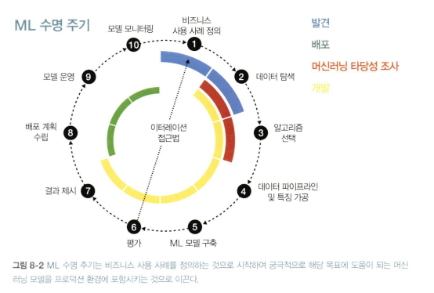

<!-- 441페이지~ -->

## ML 프로젝트 내의 패턴

### 1. ML 수명 주기

#### 발견
1. 비즈니스 사용 사례 정의
    - 모든 머신러닝 프로젝트는 비즈니스 기회에 대한 철저한 이해와 비즈니스 운영에 눈에 띄는 개선을 이뤄내야함
    - 비즈니스 목표와 작업 범위를 개략적으로 설명하기 -> 이를 통해 측정 가능한 지표를 설정 (KPI)
2. 데이터 탐색
