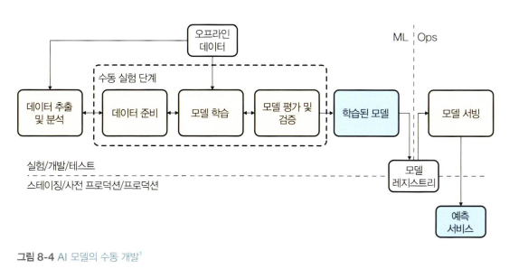
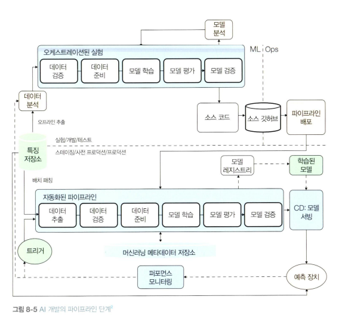

<!-- 447페이지~ -->

## ML 프로젝트 내의 패턴

### 2. AI 준비

#### 전술 단계: 수동 개발
- 여기서의 AI/ML 사용 사례는 개념 증명이나 프로토타입처럼 일부 사례에 국한됨
- 데이터는 오프라인이나 격리된 데이터 저장소에 보관되며, 데이터 탐색 및 분석을 위해 수동으로 액세스함
- 자동화 도구가 없으며 워크플로 프로세스에는 별로 신경쓰지 않음
- 이 단계에서 MLOps의 범위는 학습된 모델의 저장소로 제한됨

#### 전략 단계: 파이프라인 활용
- 비즈니스 우선순위에 AI가 할당됨. 예산도 편성됨.
- 즉시 사용 가능한 모델과 커스텀 모델을 모두 활용하는 ML 시스템을 개발할 수 있는 인프라가 마련되어있으며, 개발/프로덕션 환경 분리되어있음
- 데이터는 엔터프라이즈 데이터 웨어하우스에 저장됨
- ML 자산 관리를 위한 통합 모델이 존재
- 학습, 평가, 배치 예측을 위한 ML 워크플로는 자동화된 파이프라인에 의해 관리
-  학습된 모델은 중앙집중식 모델 레지스트리에 저장되며, 사전에 정해둔 모델 유효성 검사 지표에 따라 자동으로 배포

#### 혁신 단계: 완전 자동화
- 조직 자체에 실험-학습 문화가 육성되어 있음. 전략적 파트너십. 제품 별 AI 팀 + 고급 분석 팀 지원
- ML 프로젝트를 가속화하기 위한 표준 도구와 라이브러리는 물론, 확립된 공통 패턴과 모범 사례는 조직 내 여러 그룹 간에 쉽게 공유된다.
- 데이터셋은 모든 팀이 액세스할 수 있는 플랫폼에 저장되므로 데이터셋과 ML 자산을 쉽게 검색, 공유, 재사용할 수 있다.
- 완전자동화를 위한 조직은 모델의 구축에서 배포까지 조직의 모든 사람이 액세스할 수 있는 통합 플랫폼을 운영

